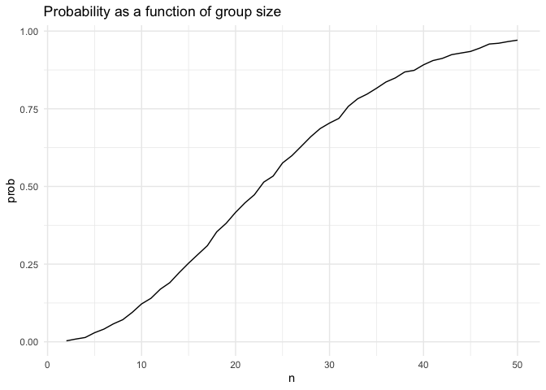

p8105_hw5_ys3924
================
YISU
2024-11-14

``` r
library(tidyverse)
```

## Problem 1

``` r
bday_simulation = function(n) {
  bdays = sample(1:365, size = n, replace = TRUE)
  duplicate = length(unique(bdays)) < n
  return(duplicate)
}
sim_result = 
  expand_grid(
    n = 2:50,
    iter = 1:10000
  ) |>
  mutate(result = map_lgl(n, bday_simulation)) |>
  group_by(n) |>
  summarize(prob = mean(result))
sim_result |>
  ggplot(aes(x = n, y = prob)) +
  geom_line() +
  labs(title = "Probability as a function of group size") +
  theme_minimal()
```

<!-- -->

Based on the result, as the group size approaches 50, the probability of
at least one shared birthday becomes close to 1.
