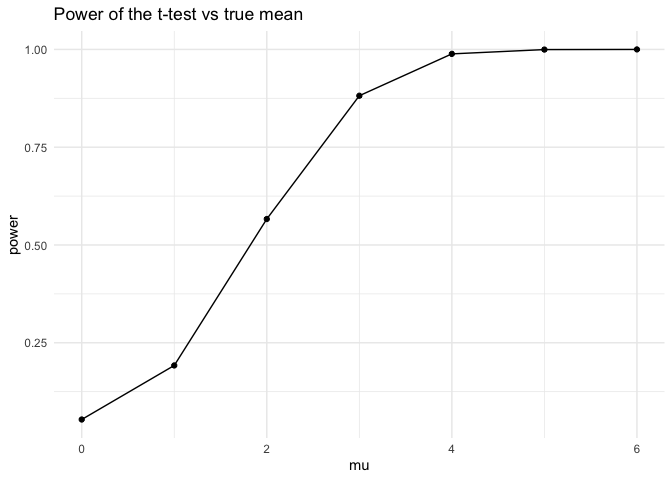

p8105_hw5_ys3924
================
YISU
2024-11-14

``` r
library(tidyverse)
```

## Problem 1

``` r
bday_simulation = function(n) {
  bdays = sample(1:365, size = n, replace = TRUE)
  duplicate = length(unique(bdays)) < n
  return(duplicate)
}
sim_result = 
  expand_grid(
    n = 2:50,
    iter = 1:10000
  ) |>
  mutate(result = map_lgl(n, bday_simulation)) |>
  group_by(n) |>
  summarize(prob = mean(result))
sim_result |>
  ggplot(aes(x = n, y = prob)) +
  geom_line() +
  labs(title = "Probability as a function of group size") +
  theme_minimal()
```

<!-- -->

Based on the result, as the group size approaches 50, the probability of
at least one shared birthday becomes close to 1.

## Problem 2

``` r
power_function = function(mu) {
  n = 30
  sigma = 5
  sample_data = rnorm(n, mean = mu, sd = sigma)
  test_result = t.test(sample_data, mu = 0) |>
    broom::tidy() |>
    select(estimate, p.value)
  return(test_result)
}
sim_mu =
  expand_grid(
  mu = 0:6,
  iter = 1:5000
) |>
  mutate(result = map_dfr(mu, power_function)) |>
  unnest(result)
sim_mu |>
  group_by(mu) |>
  summarize(power = mean(p.value < 0.05)) |>
  ggplot(aes(x = mu, y = power)) +
  geom_line() +
  geom_point() +
  labs(
    title = "Power of the t-test vs true mean",
    x = "mu",
    y = "power"
  ) +
  theme_minimal()
```

<!-- -->

From above plot, As the the true mean increases, the power of the test
also increases. Around $\mu=4$ and above, the power approaches 1, which
means that the test almost always correctly rejects the null hypothesis
when the true mean is significantly different from zero.
