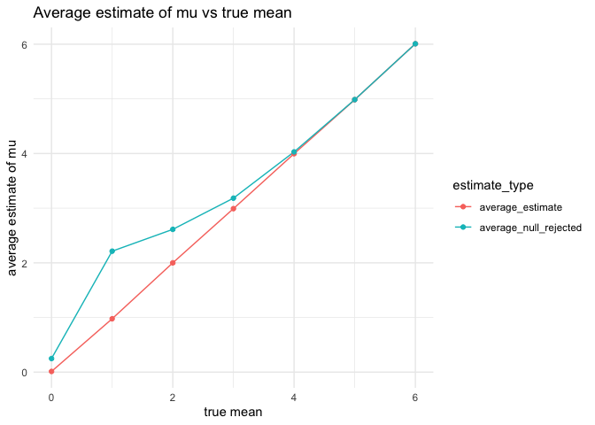

p8105_hw5_ys3924
================
YISU
2024-11-14

``` r
library(tidyverse)
library(broom)
library(knitr)
library(purrr)
```

## Problem 1

``` r
bday_simulation = function(n) {
  bdays = sample(1:365, size = n, replace = TRUE)
  duplicate = length(unique(bdays)) < n
  return(duplicate)
}
sim_result = 
  expand_grid(
    n = 2:50,
    iter = 1:10000
  ) |>
  mutate(result = map_lgl(n, bday_simulation)) |>
  group_by(n) |>
  summarize(prob = mean(result))
sim_result |>
  ggplot(aes(x = n, y = prob)) +
  geom_line() +
  labs(title = "Probability as a function of group size") +
  theme_minimal()
```

<!-- -->

Based on the result, as the group size approaches 50, the probability of
at least one shared birthday becomes close to 1.

## Problem 2

``` r
power_function = function(mu) {
  n = 30
  sigma = 5
  sample_data = rnorm(n, mean = mu, sd = sigma)
  test_result = t.test(sample_data, mu = 0) |>
    broom::tidy() |>
    select(estimate, p.value)
  return(test_result)
}
sim_mu =
  expand_grid(
  mu = 0:6,
  iter = 1:5000
) |>
  mutate(result = map_dfr(mu, power_function)) |>
  unnest(result)
sim_mu |>
  group_by(mu) |>
  summarize(power = mean(p.value < 0.05)) |>
  ggplot(aes(x = mu, y = power)) +
  geom_line() +
  geom_point() +
  labs(
    title = "Power of the t-test vs true mean",
    x = "mu",
    y = "power"
  ) +
  theme_minimal()
```

<!-- -->

From above plot, As the the true mean increases, the power of the test
also increases. Around $\mu=4$ and above, the power approaches 1, which
means that the test almost always correctly rejects the null hypothesis
when the true mean is significantly different from zero.

``` r
sim_mu |>
  group_by(mu) |>
  summarize(
    average_estimate = mean(estimate),
    average_null_rejected = mean(estimate[p.value < 0.05])
  ) |>
  pivot_longer(cols = c(average_estimate, average_null_rejected),
               names_to = "estimate_type",
               values_to = "value") |>
  ggplot(aes(x = mu, y = value, color = estimate_type)) +
  geom_line() +
  geom_point() +
  labs(
    title = "Average estimate of mu vs true mean",
    x = "true mean",
    y = "average estimate of mu"
  ) +
  theme_minimal()
```

<!-- -->

No, they are not approximately equal. When the null hypothesis is
rejected, the average estimate of $mu$ tends to be higher than the true
value of $mu$ for smaller values of $mu$, but it gets closer to the true
$mu$ as $mu$ increases. This happens because of selection bias that
rejection of the null only occurs when the sample mean is unusually
high.

## Problem 3

``` r
homicide_data = read.csv("data/homicide-data.csv") |>
  janitor::clean_names()
nrow = nrow(homicide_data)
ncol = ncol(homicide_data)
```

The data contains 52179 rows and 12 columns. The key factors include
uid, reported date, victim_last, victim_first, victim_race, victim_age,
victim_sex, city, state, lat, lon, and disposition.

``` r
homicide_df = homicide_data |>
  mutate(city_state = paste(city, state, sep = ", ")) |>
  group_by(city_state) |>
  summarize(
    total_homicides = n(),
    unsolved_homicides = sum(disposition %in% c("Closed without arrest", "Open/No arrest"))
  )
baltimore_data = homicide_df |>
  filter(city_state == "Baltimore, MD")
prop.test(
  x = baltimore_data |> pull(unsolved_homicides), 
  n = baltimore_data |> pull(total_homicides)) |>
  broom::tidy() |>
  select(estimate, conf.low, conf.high) |>
  knitr::kable()
```

|  estimate |  conf.low | conf.high |
|----------:|----------:|----------:|
| 0.6455607 | 0.6275625 | 0.6631599 |

``` r
city_test = homicide_df |>
  mutate(prop_test = map2(unsolved_homicides, total_homicides, ~ prop.test(.x, .y) |>
                            broom::tidy())) |>
  unnest(prop_test) |>
  select(city_state, total_homicides, unsolved_homicides, estimate, conf.low, conf.high)
city_test
```

    ## # A tibble: 51 × 6
    ##    city_state     total_homicides unsolved_homicides estimate conf.low conf.high
    ##    <chr>                    <int>              <int>    <dbl>    <dbl>     <dbl>
    ##  1 Albuquerque, …             378                146    0.386    0.337     0.438
    ##  2 Atlanta, GA                973                373    0.383    0.353     0.415
    ##  3 Baltimore, MD             2827               1825    0.646    0.628     0.663
    ##  4 Baton Rouge, …             424                196    0.462    0.414     0.511
    ##  5 Birmingham, AL             800                347    0.434    0.399     0.469
    ##  6 Boston, MA                 614                310    0.505    0.465     0.545
    ##  7 Buffalo, NY                521                319    0.612    0.569     0.654
    ##  8 Charlotte, NC              687                206    0.300    0.266     0.336
    ##  9 Chicago, IL               5535               4073    0.736    0.724     0.747
    ## 10 Cincinnati, OH             694                309    0.445    0.408     0.483
    ## # ℹ 41 more rows

``` r
city_test |>
  arrange(estimate) |>
  mutate(city_state = factor(city_state, levels = city_state)) |>
  ggplot(aes(x = city_state, y = estimate)) +
  geom_point() +
  geom_errorbar(aes(ymin = conf.low, ymax = conf.high), width = 0.2) +
  coord_flip() +
  labs(
    title = "Proportion of unsolved homicides by city",
    x = "city",
    y = "proportion of unsolved homicides"
  ) +
  theme(axis.text.y = element_text(size = 6, hjust = 1))
```

<!-- -->
